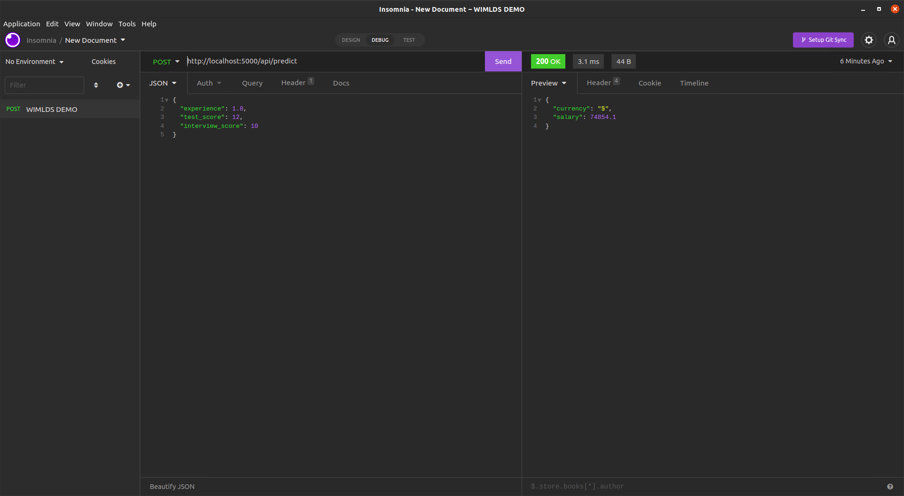

# 🚀 WIMLDS Demo Project 🚀

Demo project of my talk for Galsen AI Dakar community on `How to Deploy and Scale AI (ML or DL) Models with Kubernetes`.  

You can find the slides of my talk at <https://meissa-gai-presentation.netlify.app>.

## Description

This repo contains a `REST API` built with `Flask` that expose a machine learning model that can predict salary based on `years of experience`, `test score` and `interview score`.

## Installation

You have two ways in order to setup and run this project.

### Manual Setup

For manual installation, you need to have `Python` (version 3 is preferable) on your system. Then you can clone this repo and follow the steps below :

- Create a virtual environment with the command :
        
        python3 -m venv venv

- Activate the virtual environment with the command :
        
        . venv/bin/activate or source venv/bin/activate

- Install the necessary dependencies with the command :
        
        pip install -r requirements.txt

- Start the server with the command :
        
        python app.py

- Go to your browser at the following address :
        
        http://localhost:5000

- Or make a `POST` request at <http://localhost:5000/api/predict> with the following payload (change values if you want) :
        
        {
            "experience": 1.8,
            "test_score": 12,
            "interview_score": 10 
        }

### Docker Setup

If you have `Docker` on your system, you have two options after placing yourself in the directory of this project :

- First option :

    - Build your image with the name you want like this :

            docker build . -t salary-prediction-service

    - Run it with the following command :

            docker run -d --name salary-prediction-model -p 5000:5000 salary-prediction-service

- Second option :

    - Run the image that i already deploy on `docker hub` with the following command :

            docker run -d --name salary-prediction-model -p 5000:5000 papihack/wimlds-demo-model
    

### Kubernetes

For the deployment of this project on `K8S`, i use a tool named [Kind](https://kind.sigs.k8s.io/docs/user/quick-start/) in order to create a local kubernetes cluster. You can also use other alternatives like `minikube` if you want it too.

The manifest files are located in the `k8s` folder.

- First and foremost, you need to have or create a kubernetes cluster. After you installed `kind` on your system, you can create one with the following command :

        kind create cluster --config k8s/cluster-config.yaml --name my-cluster

The file `k8s/cluster-config.yaml` will allow you to have a cluster with `1 Master Node (Control Plane)` and `2 Worker Nodes`.

- Then you can apply the `deployment` and `service` manifest files with the command :

        kubectl apply -f k8s/service.yaml -f k8s/deployment.yaml

- Finally, since it is a `NodePort` type service, you can try to find the `IP` of one your nodes and the `generated PORT` of the service in order to try to access to the app.

You can get those infos by running the following commands :

        kubectl get svc -o wide

        kubectl get no -o wide

The url should look like at something like : `http://node-ip:svc-port` for the web page and `http://node-ip:svc-port/api/predict` for the `API`.

## Screenshots

<table>
    <tr>
        <th>API Interaction</th>
        <th>Web interface</th>
    </tr>
    <tr>
        <td></td>
        <td></td>
    </tr>
</table>

## Contributing

Feel free to make a PR or report an issue 😃

Oh, one more thing, please do not forget to put a description when you make your PR 🙂

## Author

- [M.B.C.M](https://itdev.sn)
